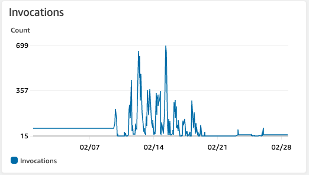
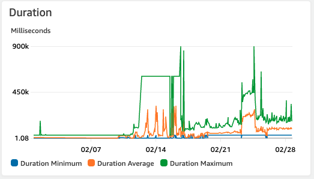

#  Audio Annotation Quality Analysis Serverless Function
 
 This serverless function was built for a large enterprise customer but is now anonymized for open source.
 It is currently running in production and has sampled over 100,000 annotated audio files across multiple projects.
 
 ## How to use
 
 Zip this repository and upload straight to your lambda function
 
 ## Historical Usage
 

 

  ## Future work
 
 * Add dependency packages 
 
 * Github Actions for publishing lambda function
 
